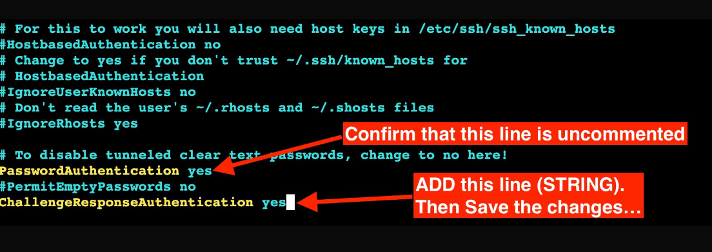

GRADLE INTEGRATION FIX;

Issues integrating the *Gradle-Build* environment with your Jenkins Master. 
There's been some new changes recently with regards to some of the new versions for Ubuntu. 
Solution: Need to pass an additional configuration for Password Authentication to be fully enabled. 

**Resolution steps steps:**

```
*SSH* into the Gradle-Build-Env VM;
*RUN:* sudo vi /etc/ssh/sshd_config
Confirm that the *PasswordAuthentication yes* STRING is uncommented as shown in the screenshot below.
Lastly, make sure to ADD the STRING (Line) *ChallengeResponseAuthentication yes* as shown also in the screenshot.
Then *SAVE* the changes
*RUN:* sudo systemstl restart ssh
*RUN:* sudo systemstl restart sshd
*Validate:* Re-Initiate The Jenkins Client(Gradle) Integration
Confirm that your Gradle client was Added Successfully…
```

